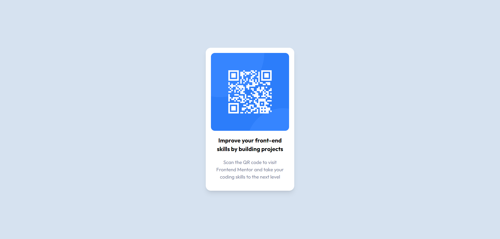

# Frontend Mentor - QR code component solution

This is a solution to the [QR code component challenge on Frontend Mentor](https://www.frontendmentor.io/challenges/qr-code-component-iux_sIO_H). Frontend Mentor challenges help you improve your coding skills by building realistic projects.

## Table of contents

- [Overview](#overview)
  - [Screenshot](#screenshot)
  - [Links](#links)
  - [Built with](#built-with)
- [Author](#author)

## Overview

### Screenshot

### Links

- Solution URL: [https://github.com/VivekanandPadala/qr-code-component](https://github.com/VivekanandPadala/qr-code-component)
- Live Site URL: [https://qr-code-component-vivekanandpadala.vercel.app/](https://qr-code-component-vivekanandpadala.vercel.app/)

### Built with

- [React](https://reactjs.org/) - JS library
- [Tailwind CSS](https://tailwindcss.com/) - For styles

## Author

- Website - [Vivekanand Padala](https://vivekanand.netlify.app/)
- Frontend Mentor - [@VivekanandPadala](https://www.frontendmentor.io/profile/VivekanandPadala)
- Twitter - [@coder_viv](https://twitter.com/coder_viv)
